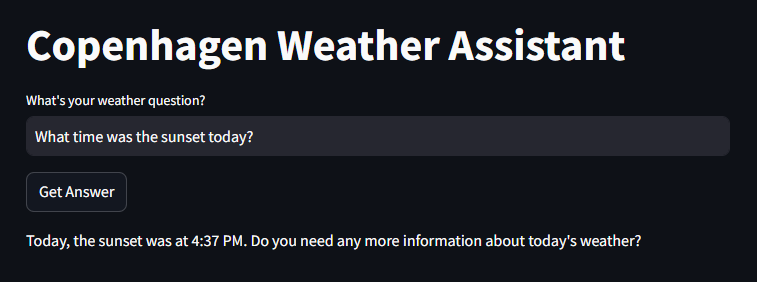

SEGI's take-home task for Axon.

Created using the open-meteo API, OpenAI's gpt-3.5-turbo and streamlit.

You can find an online version of UI of the app hosted iin Streamlit [by clicking here](https://axon-task-pleu97cy6rizdxcuaawthe.streamlit.app/).

